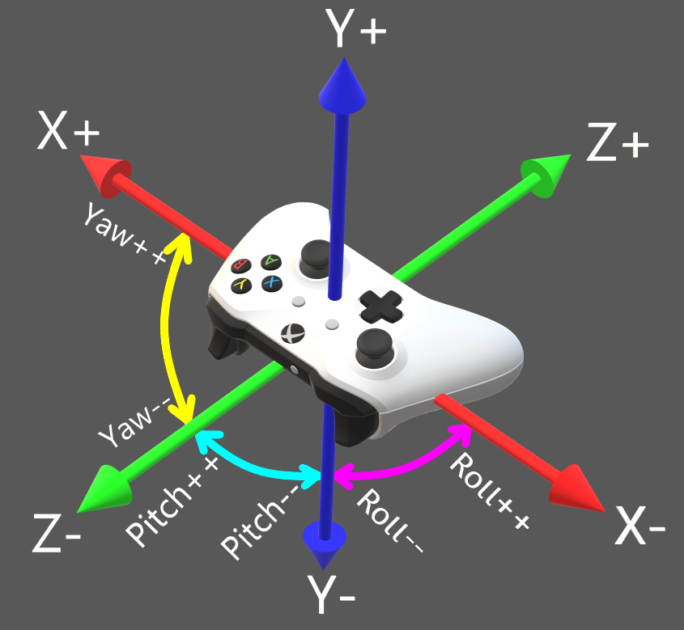

# MPU6050 Cemuhook gyro
Motion controls source with Cemuhook protocol for Cemu, yuzu, ryujinx, etc. Using ESP8266 microcontroller and MPU6050 accelerometer and gyroscope IC.

# PadTest demonstration

